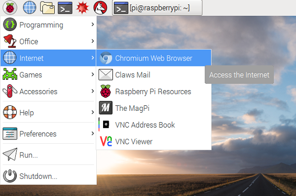

# Using Scratch 2.0 on Raspberry Pi

In this resource you will find out how to use Scratch 2.0 on Raspberry Pi.

## Updating your software

Scratch 2.0 requires software to allow Flash content to run. You will need the latest version of NOOBS to be able to use this software. 

### Using a blank SD card

Follow this guide to [get started with a blank SD card](https://www.raspberrypi.org/learning/software-guide/quickstart/) .

### Updating an existing installation
You can follow this guide to [upgrade an existing SD card](https://www.raspberrypi.org/learning/software-guide/update-sd-card/) .  

After updating the distribution you should also install the Chromium mods which will enable the Flash player software. Then reboot your pi to allow the changes to take effect.

```
sudo apt-get install -y rpi-chromium-mods
sudo reboot
```

## Opening Scratch
1. Open the Chromium Web Browser from the Internet menu
	

2. Click on a link to the Scratch page you wish to visit or type in the address. 

For the purposes of this resource we will use the [Code Club Rock Band project](https://www.codeclubprojects.org/en-GB/scratch/) as an example.

## Running the Flash Plugin

When you load up the page and scroll down to the example project, you will see a grey square appear where the project should be. This is because the Flash plugin needs your permission to run.

1. Right click on the grey square and select "Run this plug-in"
	

2. The plug in should refresh and you should see the Scratch project displayed
	

## Looking inside a project

If you visit the project page of a Scratch project and try to click on the "See inside" button, **nothing will happen**. 


For example this is the [Rock Band project page](https://scratch.mit.edu/projects/26741186/).

1. When visiting a Scratch project page directly you need to allow the Flash plugin to run first
2. Then when the plugin is running, you can click on the "See inside" button.
	

## Allowing Flash to run automatically

If you want to allow Flash plugins to always run automatically, you can follow these instructions:

1. Type about:plugins into the address bar at the top of a Chromium browser window.
2. Find Adobe Flash Player and tick the box "Always allowed to run"
	
3. Close all Chromium windows and then reopen Chromium.

This setting is not enabled by default for security reasons because it will allow **all** Flash content to run automatically, not just Scratch projects. 

## Sounds in Scratch 2.0 on Raspberry Pi

When using a sound block in a Scratch project for the first time there is a sound lag. If the sound is longer than a second then the user doesn't hear the first second of the sound, but for short < 1sec sounds, the sound doesn't play at all the first time the block is used. Running the script / clicking the block for a second time works fine.

If you click the singer sprite, the start of the sound isn't heard, but the end is. However, if you reload the page and then click the drum sprite instead then no sound is heard. Clicking the drum a second time works.